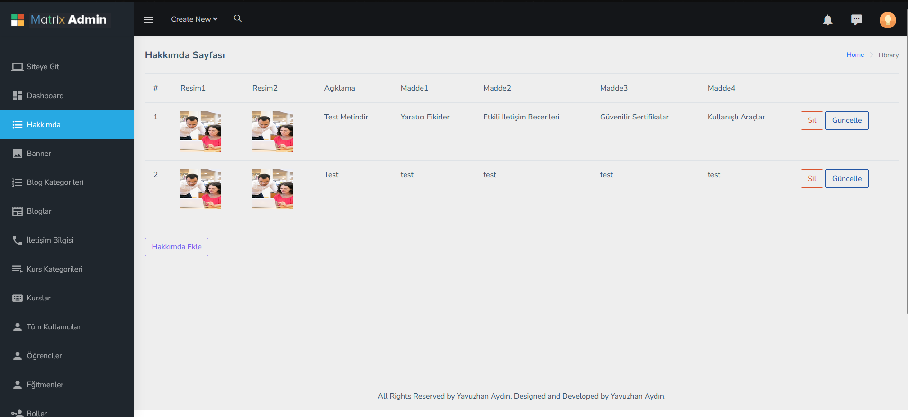
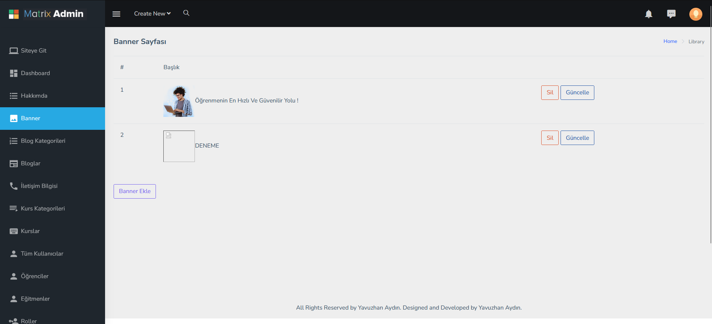
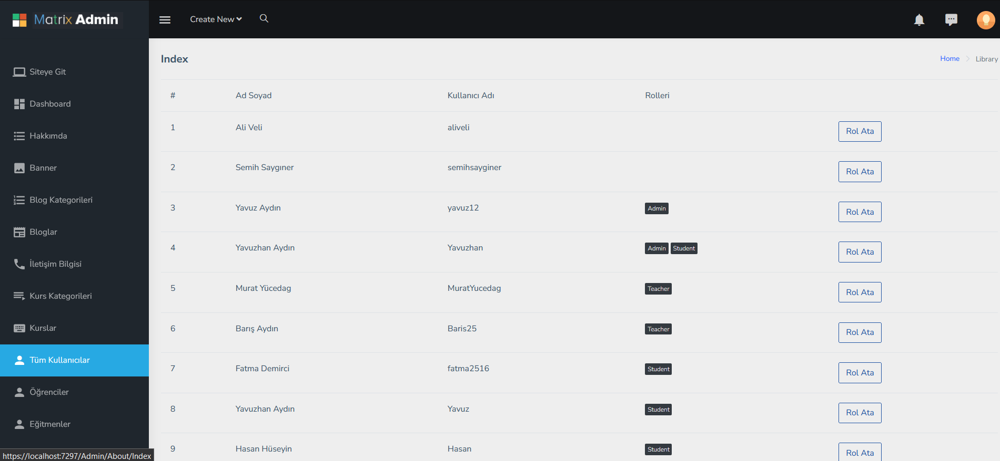
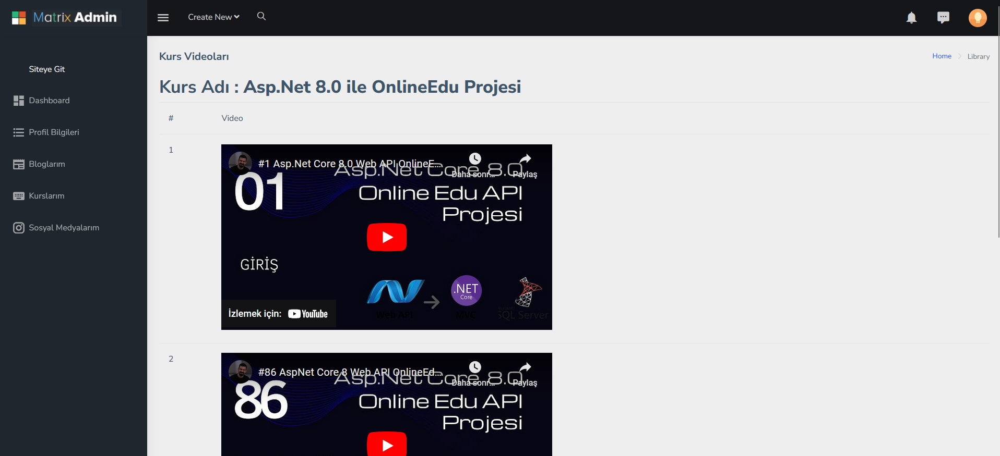
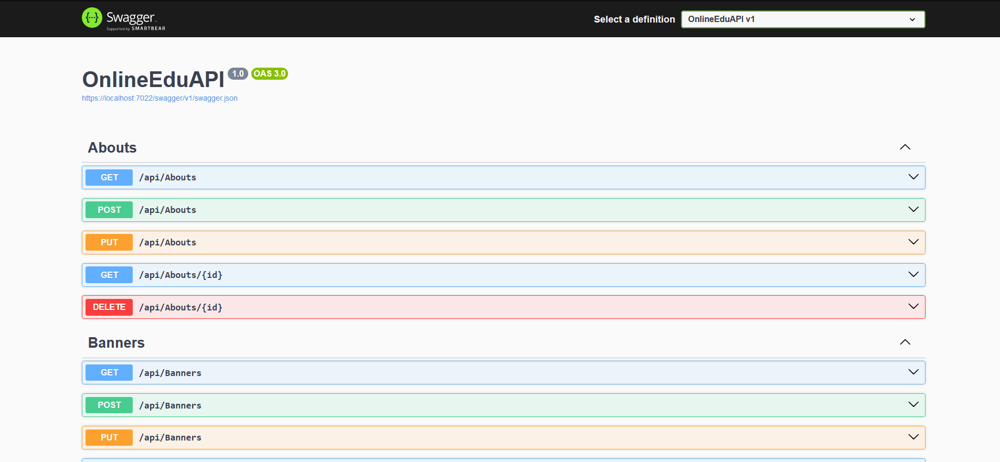
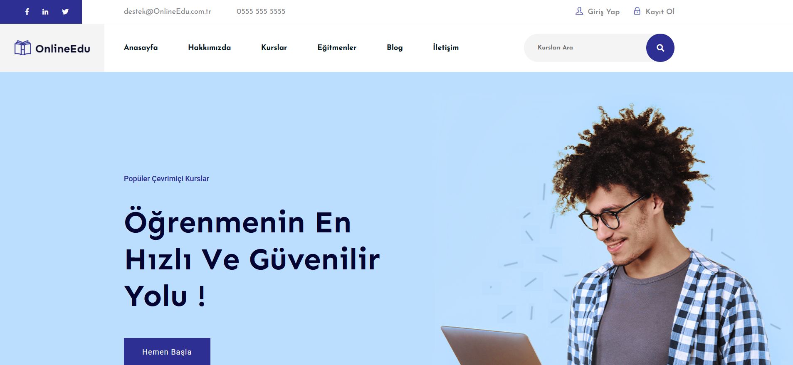

Bu proje, Erhan Gündüz tarafından YouTube'da yayınlanan bir API + API Consume projesidir. Proje, iki ana bölümden oluşmaktadır:
API tarafı ve API Consume tarafı. Her iki taraf da modern yazılım geliştirme prensiplerine uygun olarak tasarlanmıştır.

